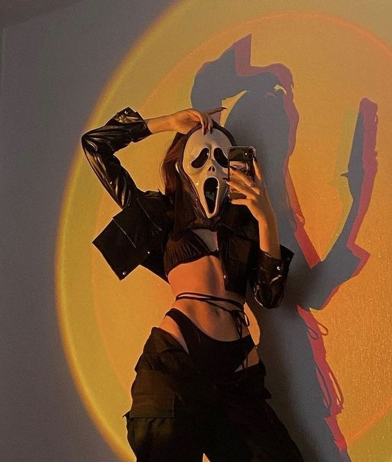

<h1 align="center">
  
</h1>

## Apresentação

### Quem é a Cyberlua?

[Luna Trevisan](https://www.instagram.com/cyberlua7/), é uma pernambucana, aluna da reprograma da turma on23 front-end e uma apaixonada pelos jogos eletrônicos e desse universo da tecnologia, e claro, amandando essa área da programação. 

#### Contatos

- [E-mail](cyberlua7@gmail.com)
- [LinkedIn](https://www.linkedin.com/in/cyberlua7/)
- [GitHub](https://github.com/cyberlua)

## Conhecendo o projeto

## 🧠 Contexto

O objetivo é criar um site usando ReactJS, onde eu possa me apresentar e enriquecer o meu portfólio, além de treinar todos os conteúdos vistos no módulo de ReactJS.

## O site pessoal conterá 4 páginas:

* Home
* Sobre
* Portfolio
* Contato

Todas as páginas terão os componentes:

* Menu
* Header
* Footer

## Estrutura do projeto

## `Tecnologias que usaremos`

| Ferramenta | Descrição |
| --- | --- |
| `ReactJS` | framework web|
| `Vite` | gerador de projeto de front-end|
| `npm` | gerenciador de pacotes|
| `Firebase` | Ferramenta realtime database para gravar as mensagens de contato|
| `Module CSS` | Ferramenta para ter mais produtividade ao estilizar a aplicação|
| `Phosphor` | Dependência com icones super legais|
| `React router dom` | Dependência para criar rotas no reactjs|
| `Axios` | Dependência para consumir api|
| `Vercel` | Hospedagem para a aplicação, fiz o deploy integrado com o github|
| `Github` | Hospedagem do código fonte integrado com gerenciador de versionamento|

# Citação e Agradecimento

Aula e Projeto criados por Simara Conceição 💜

